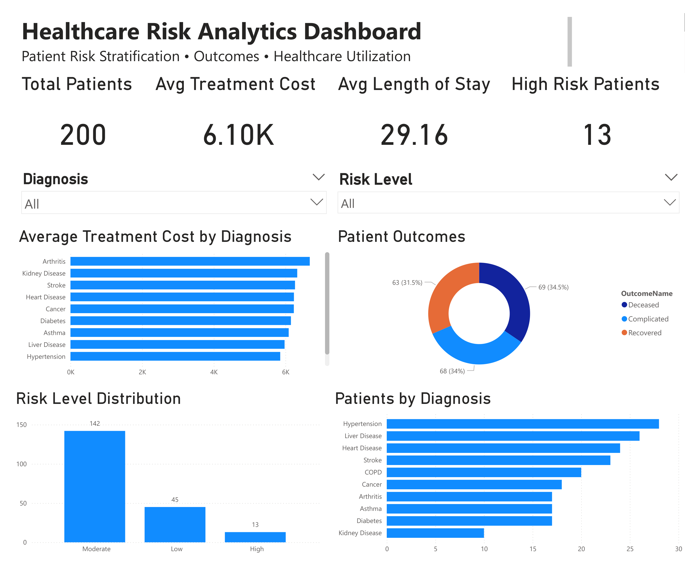

# 🏥 Healthcare Analytics & Explainable Risk Stratification

An end-to-end healthcare analytics project combining **SQL, Excel, Python, Machine Learning, Streamlit, and Power BI** to analyze patient data and develop an explainable approach to patient risk stratification.

The project follows the complete analytics workflow from relational data analysis and validation to exploratory machine learning, model evaluation, explainable risk stratification, and interactive deployment.

> **Note:** This project uses synthetic/demo healthcare data and is intended for educational and portfolio purposes only. The risk-stratification rules are illustrative and are not clinically validated or intended for medical decision-making.

---

## 🎯 Project Objectives

- Structure and analyze healthcare data using SQL
- Validate and enrich patient records using Excel
- Perform data cleaning, integration, and exploratory analysis in Python
- Experiment with machine-learning models for adverse-outcome prediction
- Evaluate model performance beyond accuracy
- Develop a transparent and explainable patient risk-stratification approach
- Build an interactive Streamlit application for individual risk assessment and population analytics

---

## 🛠️ Tools & Technologies

- **SQL Server / SSMS** — database creation, joins, aggregations, filtering, and relational analysis
- **Microsoft Excel** — data validation, lookups, calculated fields, and exploratory analysis
- **Python** — Pandas, data cleaning, feature engineering, EDA, and risk analysis
- **Scikit-learn** — preprocessing, Logistic Regression, Random Forest, and model evaluation
- **Streamlit** — interactive analytics and explainable risk-stratification application
- **Power BI** — dashboard development and healthcare data visualization

---

## 🔄 Project Workflow

### 1. SQL Analysis

Created a relational healthcare database containing:

- Patients
- Diagnoses
- Laboratory results
- Outcomes

SQL analysis included:

- Multi-table joins
- Patient laboratory history
- Average laboratory results by diagnosis
- Abnormal laboratory result analysis
- Treatment cost analysis
- Patient risk filtering
- Outcome distribution by diagnosis

### 2. Excel Validation & Analysis

Excel was used to validate and enrich the dataset using:

- XLOOKUP
- Length-of-stay calculations
- Laboratory result classification
- Risk-related calculated fields
- Data validation and exploratory analysis

### 3. Python Data Preparation & EDA

Python was used to:

- Clean and merge healthcare datasets
- Convert admission and discharge dates
- Calculate length of stay
- Reshape laboratory records into patient-level features
- Handle missing laboratory observations
- Explore diagnosis, outcome, cost, and laboratory patterns

### 4. Machine Learning Experiment

Several models were evaluated for predicting adverse patient outcomes, including:

- Logistic Regression
- Class-balanced Logistic Regression
- Random Forest

Although some models achieved moderate classification accuracy, **ROC-AUC remained approximately 0.45–0.52**, indicating weak discrimination between outcome classes.

Further investigation showed that the synthetic dataset contained sparse laboratory coverage and weak relationships between available predictors and patient outcomes.

Rather than presenting an unreliable predictive model as successful, the ML experiment was retained as an evaluation and learning component of the project.

### 5. Explainable Risk Stratification

A transparent rule-based risk score was developed using pre-outcome patient characteristics:

- Age
- Primary diagnosis
- Blood sugar
- Cholesterol
- Hemoglobin

Each triggered indicator contributes to a **0–5 risk score**, which is categorized as:

- **Low Risk**
- **Moderate Risk**
- **High Risk**

The system also displays the individual factors contributing to a patient's score, making the result directly interpretable.

The scoring framework is project-defined and illustrative rather than a clinically validated risk model.

### 6. Streamlit Application

An interactive Streamlit application was developed with two main sections:

#### 🩺 Risk Assessment

Users can enter patient characteristics and receive:

- Risk score
- Risk category
- Number of triggered indicators
- Explanation of contributing risk factors

#### 📊 Patient Analytics

The analytics dashboard provides:

- Total patient count
- Risk-level distribution
- Diagnosis distribution
- Average treatment cost
- Average length of stay

---

## 📊 Dataset

The analysis contains **200 patient records** across multiple diagnoses and outcomes.

The final stratification produced:

| Risk Level | Patients |
|------------|---------:|
| Low | 45 |
| Moderate | 142 |
| High | 13 |

Laboratory information was available for only a subset of patients, which was considered during analysis and model evaluation.

---

## 🧠 Key Learning

A major finding from this project was that **classification accuracy alone is not sufficient to determine whether a predictive model is useful**.

Model evaluation revealed weak discrimination despite apparently reasonable accuracy. Instead of forcing better performance or presenting misleading predictions, the project shifted toward transparent risk stratification and explainable analytics.

This demonstrates the importance of:

- Data-quality assessment
- Appropriate evaluation metrics
- Identifying data limitations
- Model interpretability
- Responsible communication of analytical results

---

## 📁 Repository Structure

```text
healthcare-risk-analytics/
│
├── app.py
├── healthcare_risk_final.csv
├── Healthcare_Risk_Project.ipynb
├── Healthcare_Risk_Analytics_Dashboard.pbix
├── Healthcare_Risk_Analytics_Dashboard.pdf
├── powerbi_dashboard.png
├── requirements.txt
└── README.md
```

---

## 🚀 Streamlit Application

The interactive application provides both patient-level explainable risk assessment and population-level healthcare analytics.

**Live Application:** [Launch Healthcare Risk Analytics](https://healthcare-risk-analytics.streamlit.app)

---

## 📊 Power BI Dashboard

An interactive Power BI dashboard was developed to explore patient risk stratification, outcomes, diagnosis patterns, and healthcare utilization.

### Dashboard Highlights

- **200** patient records analyzed
- Risk distribution across Low, Moderate, and High groups
- Patient outcome distribution
- Average treatment cost by diagnosis
- Patient distribution across diagnoses
- Average treatment cost and length of stay KPIs
- Interactive Diagnosis and Risk Level filters



The repository also includes the Power BI `.pbix` file and a PDF export of the completed dashboard.

---

## ⚠️ Disclaimer

This project uses synthetic/demo healthcare data and was developed for educational and portfolio purposes. The risk-stratification framework is illustrative and should not be interpreted as a clinically validated prediction or medical decision-support system.
